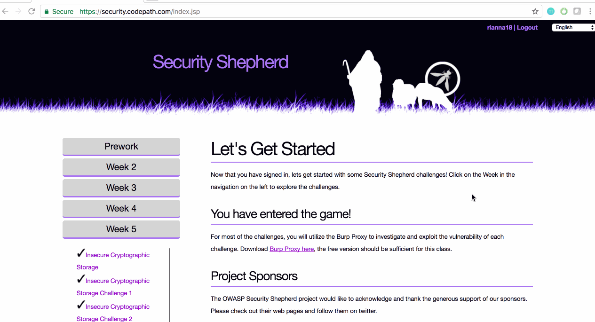

# Cybersecurity Week 5 Lab - rianna18

Time spent: 1 hour spent in total

## Project Description

This week's lab is an introduction to the basics of cryptography. The topics covered are encryption, simple ciphers, symmetric key algorithms, public key algorithms, crytopgraphic hash algorithms, checksums, and password hashing.
## User Stories

The following **required** functionality is completed:

1. [x]  Required: Challenge 0 - Insecure Cryptographic Storage
2. [x]  Required: Challenge 1 - Insecure Cryptographic Storage Challenge 1
3. [x]  Required: Challenge 2 - Insecure Cryptographic Storage Challenge 2
4. [x]  Required: Challenge 3 - PGP

The following advanced user stories are optional:

* [ ]  Bonus 1: Insecure Cryptographic Storage Challenge 3
* [ ]  Bonus 2: Insecure Cryptographic Storage Challenge 4

## Video Walkthrough

Here's a walkthrough of implemented user stories:

GIF created with [LiceCap](http://www.cockos.com/licecap/).

## Notes

This was one of my favorite labs so far as I enjoy working with hashes and encryption/decryption.

## License

    Copyright [2017] [Rianna Jawa]

    Licensed under the Apache License, Version 2.0 (the "License");
    you may not use this file except in compliance with the License.
    You may obtain a copy of the License at

        http://www.apache.org/licenses/LICENSE-2.0

    Unless required by applicable law or agreed to in writing, software
    distributed under the License is distributed on an "AS IS" BASIS,
    WITHOUT WARRANTIES OR CONDITIONS OF ANY KIND, either express or implied.
    See the License for the specific language governing permissions and
    limitations under the License.
